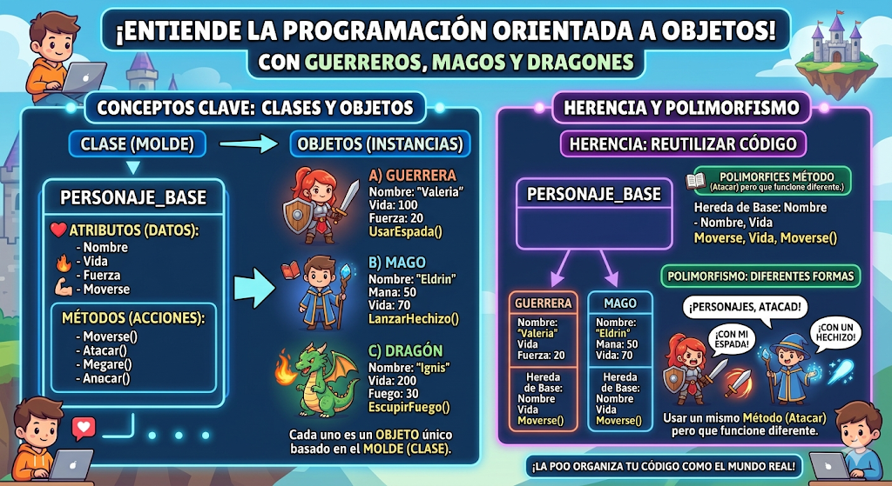

# POO en Python
Introduccion a la Programacion Orientada de Objetos (POO) en Python

## ¿Por que aprender POO?

- Imagina que quieres crear un videojuego tienes guerreros,mago,dragones.... cada uno con sus propios puntos de vida,ataques y habilidades. ¿Como los organizo en código sin repetir todo  una y otra vez?

- La **Programacion Orientada a Objetos (POO)** es la respuesta. En lugar de escribir instrucciones sueltas, modelas el mundo real con *objetos* que tienen características y comportaientos. Es la forma en que estan contruidosla mayoria de los programas profesionales del mundo.



## Clase y Objeto

- Una clase es un tipo de dato cuyas variables  se llaman objetos o instancias.

- La clase es la definición del concepto del mundo real y los objetos o instancias son el propio "Objeto" del mundo real.

- Las clases estan compuestas por dos elementos:
    - **Atríbutos:** informción que almacena la clase.
    - **Metodos:** operaciones que pueden realizarse con la clase.

## Definición de una clase en Python

```Python
class NombreClase:

    def __ini__(self, variable1, variable2):
        self.atributo1 = valor1
        self.atributo2 = valor2

    def nombreMetodo(self):
        BloqueCodigo
```

- `class` : palabra reservada en Python para definir una clase.
- `NombreClase` : nombre de la clase que se quiere crear.
- `def` : palabra reservada en Python que se utiliza para definir tanto el constructor de la clase (método que se ejecuta la primera vez que usas una clase) como los diferentes métodos que tiene.
- `__init__`: palabra reservada en Python para definir método constructor de la clase. El método `__init__` es lo primero que se ejecuta cuando creas un objeto de una clase.
- `(self, variableX)`: parámetro del constructor de la clase. El paramétro `self` es obligatorio y después puedes tener tantos parámetros como quieras. La forma de añadir parámetros es la misma que en las funciones.
- `self.AtributoX`: forma de utilización y acceso a los atributos de la clase.
- `nombreMétodo`: nombre del método de la clase.
- `self` : parámetro del método.El parámetro `self` es obligatorio y después puedes tener tantos parámetros como quieras. La forma de añadir parámetros es la misma que en las funciones.
- `BloqueCodigo` : instrucciones que ejecutará el método.

**Al definir una clase tenga en cuenta:**
- Puedes definir tantos atributos como necesites.
- Puedes definir tantos métodos como necesites.
- Puedes definir tantos parámetros en el constructor y en los métodos como necesites.